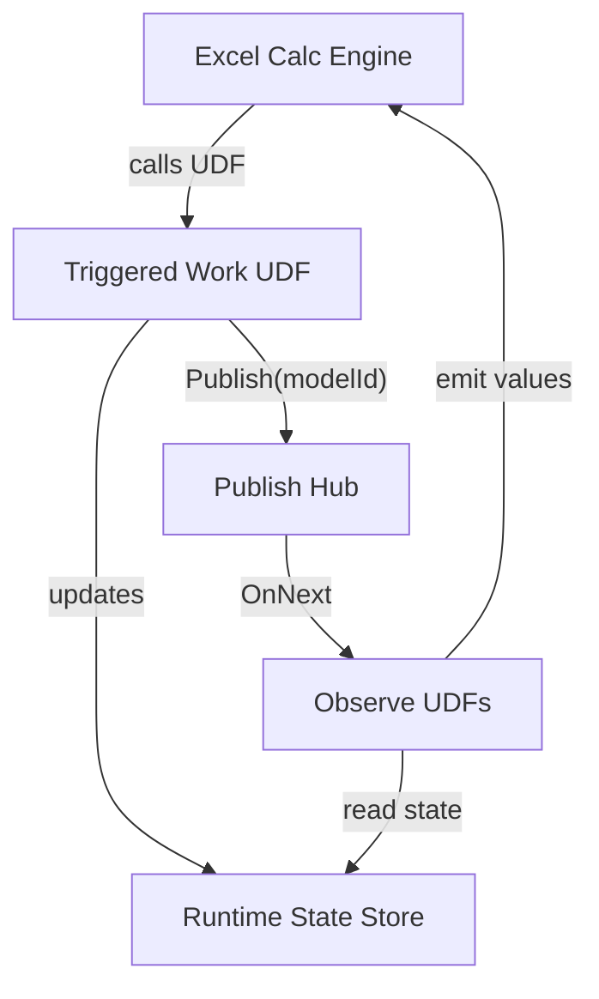
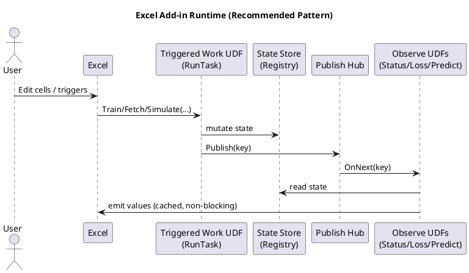

## A field guide to Excel-DNA architecture, best practices, and alternatives

**Audience:** Developers with experience in Excel, .NET, or Office, working on production add-ins for finance, engineering, analytics, or research.

**Scope:** Architectural patterns, concurrency and recalculation, deployment, security, testing, and the evolving ecosystem (VSTO, Office Add-ins, Python in Excel, PyXLL).

> This paper is intentionally **engineering-heavy**. Excel is not a normal host process; its calculation engine predates modern concurrency models, and it behaves like an aggressive, partially-deterministic scheduler. The best add-ins treat Excel formulas as a *declarative specification* and build a robust runtime **around** them.

(c) 2026 Nicolas Pepin

---

## Table of contents

1. [A brief history of Excel extensibility](A%20field%20guide%20to%20Excel-DNA%20architecture,%20best%20practices,%20and%20alternatives.md#a-brief-history-of-excel-extensibility)
2. [Excel as a runtime: a computer-science model](A%20field%20guide%20to%20Excel-DNA%20architecture,%20best%20practices,%20and%20alternatives.md#excel-as-a-runtime-a-computer-science-model)
3. [Excel-DNA in context](A%20field%20guide%20to%20Excel-DNA%20architecture,%20best%20practices,%20and%20alternatives.md#excel-dna-in-context)
4. [Three add-in architectures](A%20field%20guide%20to%20Excel-DNA%20architecture,%20best%20practices,%20and%20alternatives.md#three-add-in-architectures)
5. [Excel-DNA best practices](A%20field%20guide%20to%20Excel-DNA%20architecture,%20best%20practices,%20and%20alternatives.md#excel-dna-best-practices)
6. [The four UDF classes](A%20field%20guide%20to%20Excel-DNA%20architecture,%20best%20practices,%20and%20alternatives.md#the-four-udf-classes)
7. [Reactive design: Observables and push updates](A%20field%20guide%20to%20Excel-DNA%20architecture,%20best%20practices,%20and%20alternatives.md#reactive-design-observables-and-push-updates)
8. [State management patterns](A%20field%20guide%20to%20Excel-DNA%20architecture,%20best%20practices,%20and%20alternatives.md#state-management-patterns)
9. [Concurrency, locks, cancellation, and backpressure](A%20field%20guide%20to%20Excel-DNA%20architecture,%20best%20practices,%20and%20alternatives.md#concurrency-locks-cancellation-and-backpressure)
10. [Deployment and packaging](A%20field%20guide%20to%20Excel-DNA%20architecture,%20best%20practices,%20and%20alternatives.md#deployment-and-packaging)
11. [Testing strategy](A%20field%20guide%20to%20Excel-DNA%20architecture,%20best%20practices,%20and%20alternatives.md#testing-strategy)
12. [Security and governance](A%20field%20guide%20to%20Excel-DNA%20architecture,%20best%20practices,%20and%20alternatives.md#security-and-governance)
13. [Decision matrix and recommendations](A%20field%20guide%20to%20Excel-DNA%20architecture,%20best%20practices,%20and%20alternatives.md#decision-matrix-and-recommendations)
14. [Appendix: diagrams, templates, and checklists](A%20field%20guide%20to%20Excel-DNA%20architecture,%20best%20practices,%20and%20alternatives.md#appendix-diagrams-templates-and-checklists)
15. [References](A%20field%20guide%20to%20Excel-DNA%20architecture,%20best%20practices,%20and%20alternatives.md#references)

---

## A brief history of Excel extensibility

Excel’s approach to extensibility has accumulated in layers. Each persists because it addresses a distinct set of constraints.

### 1) Macros and the “embedded language” era (1980s onwards)

- **XLM macros** (Excel 4.0 macro sheets) enabled automation before VBA became widespread.
- **VBA** emerged as the primary “inside the workbook” language: distribution was straightforward and users could access code, but maintainability and security were limited.

### 2) Native and COM automation (1990s onwards)

- **XLL** (native) add-ins offered speed and low-level access, suitable for intensive computation, though tooling was cumbersome.
- **COM add-ins** enabled automation and UI integration, but registration and deployment were complex.

### 3) Managed code era: VSTO and Excel-DNA (mid-2000s onwards)

- **VSTO** brought Office and .NET together in a strongly-typed model, well suited for ribbon and document-level solutions.
- **Excel-DNA** provided a pragmatic alternative: “.NET in an XLL” without the complications of COM registration. It adopted the XLL model but made it more accessible to developers.

### 4) Web and cross-platform era: Office Add-ins (2010s onwards)

- Microsoft’s “modern” add-in model relies on **web technologies** (HTML/JS) and the Office JavaScript API.
- The main advantage is cross-platform support (Windows, Mac, Web).
- The main limitation is that the computational model diverges from XLL UDFs; performance and access to local resources require careful consideration.

### 5) Python and hybrid computation (2020s onwards)

- **Python in Excel** integrates Python execution directly into Excel, supporting data science workflows.
- **Third-party Python add-ins (PyXLL, xlwings)** bring Python to Excel, enabling advanced analytics but introducing packaging and runtime complexity.

Excel add-ins, in effect, represent a spectrum of trade-offs: speed versus portability, local computation versus sandboxing, workbook-native interfaces versus web-based experiences.

---

## Excel as a runtime: a computer-science model

Developing stable add-ins is easier when Excel is treated as a formal system.

### Excel recalculation as a dataflow graph

A workbook can be understood as a **directed acyclic graph (DAG)** of cell dependencies.

- Each formula is a node.
- References are edges.
- Recalculation follows a topological order, though volatile functions, circular references, iterative calculation, and external links complicate this structure.

In practice, Excel acts as:

- An **eager evaluator** (recalculating proactively),
- with **memoization** (caching computed values),
- and an expectation that UDFs behave as if pure, avoiding side effects.

### The risks of side effects

From a computer science perspective, Excel expects formulas to be **referentially transparent**:

- Identical inputs should yield identical outputs.
- No external changes should affect results unless inputs change.

Violating this principle can lead to:

- unpredictable recomputation,
- errors that only appear on reopening,
- stale caches,
- UI freezes,
- and, in severe cases, application crashes.

### Formulas as signals

A robust add-in treats Excel as a **source of signals** and implements:

- a runtime to manage state,
- a scheduler to execute work safely,
- and a reactive mechanism for UI updates.

---

## Excel-DNA in context

Excel-DNA is best described as:

- An **XLL add-in runtime** for .NET,
- exposing **worksheet functions (UDFs)** and integration points (ribbon, RTD, COM interop),
- with tools and packaging conventions that avoid the deployment issues of COM add-ins.

Excel-DNA is most effective when fast local computation, native UDF integration (including spill and calculation graph support), and a manageable, Windows-focused deployment model are required.

---

## Three add-in architectures

### Architecture A: “Pure-UDF” compute (stateless)

This approach suits deterministic calculations, pricing, and data transformations.

- Inputs: ranges or scalars
- Output: value or array
- No background processing

It is straightforward and easy to test, but unsuitable for long-running tasks, data fetching, model training, or streaming.

### Architecture B: “Triggered work + observers” (stateful, safe)

This model is used for machine learning, optimisation, downloads, simulations, and incremental computation.

- Formulas signal state transitions.
- Work runs asynchronously.
- Observers push updates without triggering workbook-wide recalculation.

It is robust for complex systems, though it demands careful runtime design (including locks, caching, and coalescing).

### Architecture C: “Hybrid UI + services” (web/taskpane + compute engine)

This pattern is suited to enterprise UI, authentication, cloud services, and cross-platform scenarios.

- UI is provided via a taskpane in Office Add-ins.
- Computation occurs locally or in the cloud.
- Results are written back to the workbook.

It offers strong UI and governance, and cross-platform potential, but introduces complexity and limited UDF parity compared to XLL.

---

## Excel-DNA best practices

### Principle 1: Avoid blocking the UI thread

If a UDF might:

- wait for I/O,
- perform heavy computation,
- acquire a contested lock,
- or call a potentially blocking library,

it should not run synchronously on the calculation thread.

Recommended approaches include:

- `ExcelAsyncUtil.RunTask(...)` for lengthy operations,
- `ExcelAsyncUtil.Observe(...)` for streaming or reactive values,
- and “try-lock plus cached fallback” patterns for observers.

### Principle 2: Prefer idempotence over cleverness

Any formula may execute:

- multiple times,
- on workbook open,
- during copy-fill,
- during partial calculation,
- during UI edits,
- or when a sheet is activated.

If identical inputs do not produce identical behaviour, the add-in will eventually fail.

### Principle 3: Separate identity from state

A cell often requires a stable identifier (such as a model or handle ID) that persists across recalculations.

- Identity should remain stable for unchanged inputs.
- State should be managed within the runtime (registry or store).

---

## The four UDF classes

### 1) Pure functions (stateless)

Rule: identical inputs yield identical outputs. No shared state.

Example: matrix multiplication, Black–Scholes, string parsing.

```csharp
[ExcelFunction(Name="MATH.DOT")]
public static double Dot(double[] a, double[] b) { ... }
```

### 2) Identity or creation functions (idempotent, cached)

Rule: return the same handle when inputs are unchanged; avoid recreating on recalculation.

Pattern: cache by caller (per cell), with optional trigger.

```csharp
static readonly object _lock = new();
static readonly Dictionary<string, string> _byCaller = new();

[ExcelFunction(Name="APP.RESOURCE_CREATE")]
public static string ResourceCreate(string spec, object trigger = null)
{
    var caller = CallerAddress();           // "'Sheet1'!$E$2"
    var trig   = TriggerKey(trigger);       // normalised signal

    lock (_lock)
    {
        if (_byCaller.TryGetValue(caller, out var id) && IsSameTrigger(caller, trig))
            return id;

        id = RuntimeCreateResource(spec);
        _byCaller[caller] = id;
        RememberTrigger(caller, trig);
        return id;
    }
}
```

A per-cell cache is necessary because Excel may re-evaluate the formula; a deterministic “sticky identity” is required for each sheet location.

### 3) Triggered work functions (asynchronous, fire-once semantics)

Rule: long-running work must be asynchronous and should only run once per trigger.

```csharp
[ExcelFunction(Name="APP.TRAIN")]
public static object Train(string modelId, object[,] X, object[,] y, string opts, object trigger)
{
    var key = TriggerKey(trigger);
    var model = Registry.Get(modelId);

    if (model.LastTrigger == key) return "skipped";

    return ExcelAsyncUtil.RunTask("APP.TRAIN", new object[]{ modelId, key }, async () =>
    {
        await model.Lock.WaitAsync().ConfigureAwait(false);
        try
        {
            if (model.LastTrigger == key) return "skipped";

            model.IsBusy = true;
            model.Version++;
            Hub.Publish(modelId);

            await DoTrainingAsync(model, X, y, opts).ConfigureAwait(false);

            model.LastTrigger = key;
            model.IsBusy = false;
            Hub.Publish(modelId);
            return "done";
        }
        finally
        {
            model.IsBusy = false;
            model.Lock.Release();
        }
    });
}
```

### 4) Observer functions (push-based, cached)

Rule: never block; return cached values; update only on meaningful state transitions.

```csharp
[ExcelFunction(Name="APP.STATUS")]
public static object Status(string modelId)
{
    return ExcelAsyncUtil.Observe("APP.STATUS", new object[]{ modelId }, () =>
        new StatusObservable(modelId));
}
```

---

## Reactive design: Observables and push updates

The prevailing pattern for “live” Excel experiences is as follows:

1) lengthy work updates shared state,
2) publishes a signal (`Publish(modelId)`), and
3) observers re-emit values by reading the updated state.

### Mermaid diagram: signal flow



### Why this approach is effective

The structure reflects a classic event-driven architecture:

- The store functions as the authoritative source.
- Events serve as notifications rather than data payloads.
- Observers execute a "read model, render view" process.

Such a design mitigates several risks:

- Data races that arise from directly pushing values into cells.
- Unnecessary workbook recalculation.
- Blocking calls during ongoing operations.

### Refrain from using workbook-wide recalculation as an update mechanism

A frequent anti-pattern involves the following sequence:

- Training completes, a recalculation is forced, and one hopes all elements update accordingly.

This method can result in calculation storms, user interface stalls, increased volatility, and repeated creation of user-defined functions.

Recalculation should be reserved as a fallback for volatile inspectors or legacy functions.

---

## State management patterns

### In-memory registry pattern (handle to model state)

```csharp
static ConcurrentDictionary<string, ModelState> _models = new();

public static string Create(string desc)
{
    var id = Guid.NewGuid().ToString("N");
    _models[id] = new ModelState(desc);
    return id;
}

public static bool TryGet(string id, out ModelState model) =>
    _models.TryGetValue(id, out model);
```

**Advantages:** Fast and straightforward, well suited to interactive sessions.  
**Limitations:** State is lost when Excel restarts; rehydration from workbook signals or persisted packages is required.

### Rehydration on open

Where models must persist upon opening a workbook, a rehydration strategy is necessary:

- Option A: Formulas deterministically recreate models (preferred).
- Option B: AutoOpen initiates a recalculation (occasionally required).
- Option C: Persistent storage (file or database) combined with load formulas.

> Important: A workbook cell can store a model id string, but it **cannot store the model**. The runtime state must be reconstructed.

### Versioning for caches

Attach monotonic version numbers to model state:

- `Version++` at the start of training.
- Treat a change in version, provided `Version++` is false, as an indication that a new stable state is available.

Observers should cache the last version observed and the last values emitted.

This constitutes memoization with invalidation.

---

## Concurrency, locks, cancellation, and backpressure

### Locks are permissible; blocking is not

Excel permits the use of locks, but freezing the user interface is unacceptable.

**Guiding principles:**

1. For lengthy operations, use `await` or background threads via `RunTask`.
2. Observers should employ try-lock or lock-free reads, avoiding waits.
3. Dispose of native resources in a deterministic manner.

### `SemaphoreSlim` pattern for model exclusivity

- Training acquires the lock.
- Prediction uses `Wait(0)` and returns cached data if the model is busy.

```csharp
if (!model.Lock.Wait(0)) return _cached;
try { return Compute(); }
finally { model.Lock.Release(); }
```

### Cancellation tokens

Enable users to cancel operations:

- Provide `CANCEL(modelId, trigger)` or a "cancel all" ribbon button.
- Store a `CancellationTokenSource` within the model state.
- Check the token periodically within loops.

```csharp
for (int e=0; e<epochs; e++)
{
    token.ThrowIfCancellationRequested();
    ...
    if (e % 20 == 0) await Task.Yield();
}
```

### Pattern: coalescing and backpressure

Excel can produce “event storms”:

- users edit ranges,
- calc engine reevaluates,
- multiple observers receive frequent signals.

Coalesce:

- publish at a controlled cadence,
- throttle UI notifications,
- collapse repeated “same state” emissions.

---

## Deployment and packaging

Deployment is where add-ins die. Treat it as a first-class design constraint.

### Excel-DNA typical deployment shapes

1) **Internal desktop deployment**: copy XLL + managed DLLs + native dependencies beside it
2) **Installer-based**: MSIX / MSI, controlled folder, update channel
3) **ClickOnce-like**: less common today, but possible through enterprise tooling

### “Single file” reality check

For Excel-DNA + native libs, “single file” generally means:

- a single *distribution artifact* (zip/msix) that expands to multiple files, **or**
- embedding resources and extracting at runtime (complex, brittle, can trip antivirus / policy)

For “one physical file next to workbook,” consider Office Add-ins or Python in Excel for portability—but accept the tradeoffs.

### Hard-won practical rules

- Keep all native dependencies **next to** the XLL (or in a deterministic extraction directory).
- Don’t depend on global PATH.
- Avoid writing to protected locations (`Program Files`) unless installer grants permissions.
- Be explicit about x86 vs x64 (most native stacks are architecture-specific).

---

## Testing strategy

### 1) Unit tests: pure logic

- parsing, validation, option parsing
- deterministic numerical kernels
- serialization

### 2) Integration tests: “headless Excel” is hard

Excel is not a great headless test target.

Practical approaches:

- a “calc harness” workbook used in CI with UI automation (slow but real)
- a COM-driven automation test runner (fragile but doable)
- isolate Excel-facing code to thin adapters; test core engine separately

### 3) Performance tests: treat recalculation as load

Measure:

- how many UDF calls occur on open,
- how many on a typical edit,
- memory churn per recalc,
- time-to-interactive after calc.

---

## Security and governance

### Threat model

Add-ins run with user privileges and can:

- read/write files,
- call network,
- load native code,
- access workbook contents.

Security failures are usually:

- supply chain (dependency injection),
- unsafe extraction,
- uncontrolled plugin loading,
- untrusted workbook content driving dangerous operations.

### Controls

- code signing and trusted locations
- explicit allowlists for file I/O
- no dynamic code loading from workbook inputs
- secure update distribution

For enterprise: Office Add-ins often integrate more cleanly with modern governance, SSO, and central deployment—at the cost of local compute flexibility.

---

## Decision matrix and recommendations

### Choose Excel-DNA when you need

- high-performance local compute
- tight UDF integration
- C#/F#/.NET libraries
- Windows-first deployment is acceptable

### Choose VSTO when you need

- deep Office object model integration
- document-level customization
- classic .NET UI patterns
  …and you accept .NET Framework and installer-level deployment.

### Choose Office Add-ins when you need

- cross-platform
- modern UI/taskpane experiences
- cloud integration and governance
  …and you accept JavaScript API constraints and different computation patterns.

### Choose Python in Excel / PyXLL / xlwings when you need

- Python-first workflows
- rapid data science iteration
- existing Python ecosystems
  …and you accept runtime packaging differences and (often) cloud/sandbox constraints.

---

## Appendix: diagrams, templates, and checklists

### A) “Four UDF classes” architecture (PlantUML)



### B) Design review checklist (for printing)

- **Purity:** Are "pure UDFs" genuinely free of side effects?
- **Identity:** Are handle or creation UDFs idempotent per cell?
- **Triggers:** Is there a stable, explicit trigger for lengthy operations?
- **Async:** Does long-running work avoid blocking user interface threads?
- **Observers:** Do observer UDFs avoid waiting on locks?
- **Caching:** Is caching based on stable versions rather than timestamps?
- **Coalescing:** Are publish storms throttled?
- **Disposal:** Are tensors and handles disposed of deterministically?
- **Recalculation:** Is workbook-wide recalculation avoided or consolidated?
- **Deployment:** Are native dependencies deterministic and matched to the architecture?
- **Security:** Are workbook-driven inputs validated and sandboxed?

### C) Minimal "Observable UDF" template

```csharp
public static object ObserveValue(string key)
{
    return ExcelAsyncUtil.Observe("APP.OBS", new object[]{ key }, () => new Obs(key));
}

sealed class Obs : IExcelObservable
{
    readonly string _key;
    object _cached = "initial";
    long _version = -1;

    public Obs(string key) => _key = key;

    public IDisposable Subscribe(IExcelObserver observer)
    {
        observer.OnNext(ReadOrCached());
        return Hub.Subscribe(_key, new Inner(observer, this));
    }

    object ReadOrCached()
    {
        var state = Store.Get(_key);
        if (state.Version == _version) return _cached;
        if (state.IsBusy) return _cached;

        var v = ComputeNonBlocking(state);  // try-lock pattern
        if (v == null) return _cached;

        _cached = v;
        _version = state.Version;
        return _cached;
    }

    sealed class Inner : IExcelObserver
    {
        readonly IExcelObserver _o; readonly Obs _p;
        public Inner(IExcelObserver o, Obs p) { _o=o; _p=p; }
        public void OnNext(object _) => _o.OnNext(_p.ReadOrCached());
        public void OnError(Exception e) => _o.OnError(e);
        public void OnCompleted() => _o.OnCompleted();
    }
}
```

---

## References

The following primary sources are recommended starting points.

### Excel-DNA

- [Excel-DNA GitHub Organization](https://github.com/excel-dna)
- [Excel-DNA Core Repository](https://github.com/Excel-DNA/ExcelDna)

### Microsoft Office Add-ins

- [Office Add-ins Platform Overview](https://learn.microsoft.com/office/dev/add-ins/overview/office-add-ins)
- [Office Add-ins Manifest Concepts](https://learn.microsoft.com/office/dev/add-ins/develop/add-in-manifests)

### VSTO (Visual Studio Tools for Office)

- [VSTO Overview (Legacy .NET Framework Add-ins)](https://learn.microsoft.com/visualstudio/vsto/office-solutions-development-overview-vsto?view=vs-2022)

### Python in Excel

- [Announcing Python in Excel](https://techcommunity.microsoft.com/blog/excelblog/announcing-python-in-excel-combining-the-power-of-python-and-excel/3848712)
- [Deploy Python in Excel](https://learn.microsoft.com/microsoft-365/education/deploy-python-in-excel)
- [Python in Excel Support](https://support.microsoft.com/office/python-in-excel-3b43d5b8-5d5f-4af7-a4b3-3e9b2c7d57e5)

### PyXLL

- [PyXLL Documentation](https://support.pyxll.com/)
- [How to Distribute a PyXLL Add-in Without Python Source Code](https://support.pyxll.com/hc/en-gb/articles/45352826390675-How-to-distribute-a-PyXLL-add-in-without-Python-source-code)
