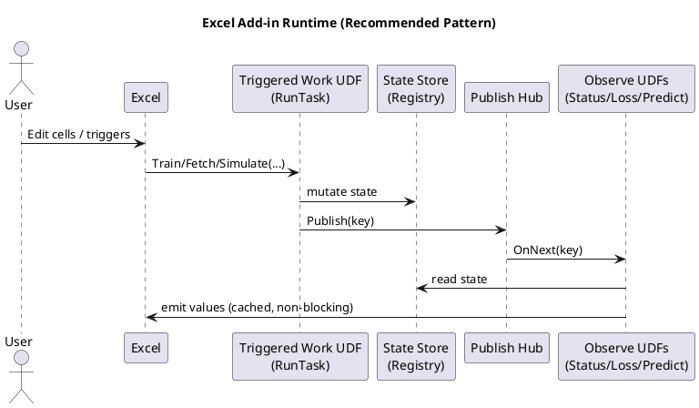

# Excel Add-ins in the Real World (2026)
## An advanced, publication-ready field guide to Excel-DNA architectural patterns, best practices, and modern alternatives

**Audience:** experienced Excel / .NET / Office developers building production-grade add-ins (finance, engineering, analytics, research tooling).  
**Scope:** architectural patterns, concurrency + recalculation semantics, deployment, security, testing, and the modern ecosystem (VSTO, Office Add-ins, Python in Excel, PyXLL).

> This paper is intentionally **engineering-heavy**. Excel is not a normal host process; its calculation engine predates modern concurrency models, and it behaves like an aggressive, partially-deterministic scheduler. The best add-ins treat Excel formulas as a *declarative specification* and build a robust runtime **around** them.

---

## Table of contents

1. [A brief history of Excel extensibility](#a-brief-history-of-excel-extensibility)  
2. [Excel as a runtime: a computer-science model](#excel-as-a-runtime-a-computer-science-model)  
3. [Excel-DNA in context](#excel-dna-in-context)  
4. [Three add-in architectures](#three-add-in-architectures)  
5. [Excel-DNA best practices](#excel-dna-best-practices)  
6. [The four UDF classes](#the-four-udf-classes)  
7. [Reactive design: Observables and push updates](#reactive-design-observables-and-push-updates)  
8. [State management patterns](#state-management-patterns)  
9. [Concurrency, locks, cancellation, and backpressure](#concurrency-locks-cancellation-and-backpressure)  
10. [Deployment and packaging](#deployment-and-packaging)  
11. [Testing strategy](#testing-strategy)  
12. [Security and governance](#security-and-governance)  
13. [Decision matrix and recommendations](#decision-matrix-and-recommendations)  
14. [Appendix: diagrams, templates, and checklists](#appendix-diagrams-templates-and-checklists)  
15. [References](#references)

---

## A brief history of Excel extensibility

Excel’s extension story has evolved in **layers**, not replacements. Each layer still exists because it solves a different constraints set.

### 1) Macros and the “embedded language” era (1980s →)
- **XLM macros** (Excel 4.0 macro sheets) enabled automation before VBA was widely used.
- **VBA** became the dominant “inside the workbook” language: easy distribution, user-accessible, but with well-known maintainability/security limits.

### 2) Native and COM automation (1990s →)
- **XLL** (native) add-ins: fast, low-level, excellent for heavy compute; painful tooling.
- **COM add-ins**: automation and UI integration, but COM registration and deployment complexity.

### 3) Managed code era: VSTO and Excel-DNA (mid‑2000s →)
- **VSTO** integrated Office + .NET in a strongly-typed model, ideal for ribbon/UI + document-level solutions.
- **Excel-DNA** emerged as a pragmatic approach: “.NET in an XLL” without COM registration pain. It leaned into the XLL model but made it **developer-friendly**.

### 4) Web and cross-platform era: Office Add-ins (2010s →)
- Microsoft’s “modern” add-in model uses **web technologies** (HTML/JS) plus the Office JavaScript API.
- The major upside: cross-platform (Windows/Mac/Web).
- The major constraint: computational model differs from XLL UDFs; performance and local system access require careful design.

### 5) Python and hybrid computation (2020s →)
- **Python in Excel**: built-in Python execution integrated into Excel for data science workflows.
- **Third-party Python add-ins (PyXLL, xlwings)**: Python is “brought to Excel” rather than Excel “brought to Python,” enabling rich analytics at the cost of packaging/runtime complexity.

**Key takeaway:** Excel add-ins are a *spectrum* of tradeoffs: speed vs portability, local compute vs sandbox, workbook-native UX vs web UX.

---

## Excel as a runtime: a computer-science model

To build stable add-ins, it helps to treat Excel as a formal system.

### Excel recalculation resembles a dataflow graph scheduler

A workbook can be modeled as a **directed acyclic graph (DAG)** of cell dependencies.

- Each formula is a node.
- References are edges.
- Recalculation is a topological update—**with caveats**: volatile functions, circular references, iterative calculation, and external links complicate the graph.

In practice, Excel behaves like:
- An **eager evaluator** (it recalculates aggressively),
- with **memoization** (it caches computed cell values),
- and **side-effect intolerance** (UDFs are expected to behave “as if” pure).

### Why side effects are dangerous

From a CS perspective, Excel expects formulas to be **referentially transparent**:
- Same inputs → same outputs.
- No external mutation that changes “meaning” without changing inputs.

When UDFs violate this, you get:
- non-deterministic recompute storms,
- “works until open” bugs,
- stale caches,
- UI freezes,
- in the worst case: Excel crashes.

### Design principle: treat formulas as *signals*

A robust add-in treats Excel as a **signal source** and implements:
- a *runtime* that owns state,
- a *scheduler* that runs work safely,
- and a *reactive UI* update mechanism.

---

## Excel-DNA in context

Excel-DNA is best thought of as:

- An **XLL add-in runtime** for .NET,
- exposing **worksheet functions (UDFs)** and integration points (ribbon, RTD, COM interop),
- with tools and packaging conventions that avoid COM add-in deployment pain.

Excel-DNA shines when you need:
- **fast local compute**,
- **native UDF integration** (spill, calc graph),
- and a deployment model that is still Windows-first but manageable.

---

## Three add-in architectures

### Architecture A: “Pure-UDF” compute (stateless)
Best for deterministic math, pricing, transforms.

- Inputs: ranges/scalars
- Output: value/array
- No background work

✅ Easy to reason about, easiest to test  
❌ Hard for long-running work, data fetching, model training, streaming

### Architecture B: “Triggered work + observers” (stateful, safe)
Best for: ML, optimization, downloads, simulations, incremental compute.

- Formulas *signal* state transitions.
- Work runs async.
- Observers push updates without workbook-wide recalculation.

✅ The most robust pattern for complex systems  
❌ Requires careful runtime design (locks, caching, coalescing)

### Architecture C: “Hybrid UI + services” (web/taskpane + compute engine)
Best for: enterprise UI, auth, cloud services, cross-platform reach.

- Taskpane in Office Add-ins for UI
- Local or cloud compute engine
- Results written back into workbook

✅ Strong UI/UX, governance, cross-platform potential  
❌ More moving parts; UDF parity is limited vs XLL

---

## Excel-DNA best practices

### Principle 1: Never block the UI thread
If your UDF might:
- wait on I/O,
- do heavy compute,
- acquire a contended lock,
- or call into a library that might block,

…then **do not execute it synchronously** on the calc thread.

**Use:**
- `ExcelAsyncUtil.RunTask(...)` for long work,
- `ExcelAsyncUtil.Observe(...)` for streaming / reactive values,
- “try-lock + cached fallback” patterns for observers.

### Principle 2: Prefer idempotence to cleverness
Every formula may run:
- multiple times,
- on open,
- during copy-fill,
- during partial calc,
- during UI edits,
- during sheet activation.

If “same inputs” doesn’t mean “same behavior,” your add-in will eventually fail.

### Principle 3: Distinguish identity from state
A cell often needs a stable *identifier* (model id, handle id) that outlives recalculation.

- Identity should be stable for unchanged inputs.
- State should live in your runtime (registry / store).

---

## The four UDF classes

### 1) Pure functions (stateless)
**Rule:** same inputs → same output. No shared state.

Example: matrix multiply, Black–Scholes, string parsing.

```csharp
[ExcelFunction(Name="MATH.DOT")]
public static double Dot(double[] a, double[] b) { ... }
```

### 2) Identity / creation functions (idempotent, cached)
**Rule:** return the same handle when inputs are unchanged; do not recreate on recalc.

**Pattern:** caller-keyed cache (per-cell) + optional trigger.

```csharp
static readonly object _lock = new();
static readonly Dictionary<string, string> _byCaller = new();

[ExcelFunction(Name="APP.RESOURCE_CREATE")]
public static string ResourceCreate(string spec, object trigger = null)
{
    var caller = CallerAddress();           // "'Sheet1'!$E$2"
    var trig   = TriggerKey(trigger);       // normalized signal

    lock (_lock)
    {
        if (_byCaller.TryGetValue(caller, out var id) && IsSameTrigger(caller, trig))
            return id;

        id = RuntimeCreateResource(spec);
        _byCaller[caller] = id;
        RememberTrigger(caller, trig);
        return id;
    }
}
```

**Why per-cell cache?** Because Excel will re-evaluate the formula; you need a deterministic “sticky identity” that corresponds to a specific location in the sheet.

### 3) Triggered work functions (async, fire-once semantics)
**Rule:** long-running work must be asynchronous and guarded to run once per trigger.

```csharp
[ExcelFunction(Name="APP.TRAIN")]
public static object Train(string modelId, object[,] X, object[,] y, string opts, object trigger)
{
    var key = TriggerKey(trigger);
    var model = Registry.Get(modelId);

    if (model.LastTrigger == key) return "skipped";

    return ExcelAsyncUtil.RunTask("APP.TRAIN", new object[]{ modelId, key }, async () =>
    {
        await model.Lock.WaitAsync().ConfigureAwait(false);
        try
        {
            if (model.LastTrigger == key) return "skipped";

            model.IsBusy = true;
            model.Version++;
            Hub.Publish(modelId);

            await DoTrainingAsync(model, X, y, opts).ConfigureAwait(false);

            model.LastTrigger = key;
            model.IsBusy = false;
            Hub.Publish(modelId);
            return "done";
        }
        finally
        {
            model.IsBusy = false;
            model.Lock.Release();
        }
    });
}
```

### 4) Observer functions (push-based, cached)
**Rule:** never block; return cached values; update only on meaningful state transitions.

```csharp
[ExcelFunction(Name="APP.STATUS")]
public static object Status(string modelId)
{
    return ExcelAsyncUtil.Observe("APP.STATUS", new object[]{ modelId }, () =>
        new StatusObservable(modelId));
}
```

---

## Reactive design: Observables and push updates

The dominant stable pattern for “live” Excel experiences is:

1) long work updates shared state, then  
2) publishes a signal (`Publish(modelId)`), and  
3) observers re-emit values by reading state.

### Mermaid diagram: signal flow

```mermaid
flowchart LR
  Excel[Excel Calc Engine] -->|calls UDF| UDF[Triggered Work UDF]
  UDF -->|updates| Store[(Runtime State Store)]
  UDF -->|Publish(modelId)| Hub[Publish Hub]
  Hub -->|OnNext| Obs[Observe UDFs]
  Obs -->|read state| Store
  Obs -->|emit values| Excel
```

### Why this works
This matches a classic **event-driven architecture**:
- store is the “source of truth”
- events are notifications, not data payloads
- observers perform “read model → render view”

This avoids:
- data races from “push values directly into cells”
- forcing workbook recalculation
- blocking calls while work is in-flight

### Avoid: workbook-wide recalculation as your update mechanism
A common anti-pattern is:
- “training finished → force recalc → hope everything updates.”

This can:
- create calc storms,
- cause UI stalls,
- amplify volatility,
- and re-trigger creation UDFs.

Use recalc *only as a fallback* for volatile inspectors or legacy functions.

---

## State management patterns

### Pattern: in-memory registry (handle → model state)

```csharp
static ConcurrentDictionary<string, ModelState> _models = new();

public static string Create(string desc)
{
    var id = Guid.NewGuid().ToString("N");
    _models[id] = new ModelState(desc);
    return id;
}

public static bool TryGet(string id, out ModelState model) =>
    _models.TryGetValue(id, out model);
```

**Pros:** fast, simple, ideal for interactive sessions  
**Cons:** lost on Excel restart; must rehydrate from workbook signals or persisted packages

### Pattern: “rehydration on open”
If your models need to exist on workbook open, you need a **rehydration strategy**:

- Option A: formulas recreate models deterministically (preferred)
- Option B: AutoOpen queues a recalc (sometimes necessary)
- Option C: persistent store (file/db) + load formulas

> Important: A workbook cell can store a model id string, but it **cannot store the model**. The runtime state must be reconstructed.

### Pattern: versioning for caches
Attach monotonic versions to model state:
- `Version++` on training start
- treat “Version changed AND IsBusy=false” as “new stable state available”

Observers cache:
- last version seen,
- last emitted values.

This is **memoization with invalidation**.

---

## Concurrency, locks, cancellation, and backpressure

### “Locks are not bad; blocking is bad”
Excel doesn’t forbid locks—it forbids freezing the UI.

**Golden rules**
1. Long work: use `await` / background threads via `RunTask`.
2. Observers: **try-lock** or lock-free reads; never wait.
3. Dispose native resources deterministically.

### Pattern: `SemaphoreSlim` for model exclusivity
- Training holds the lock.
- Prediction uses `Wait(0)` and returns cached data if busy.

```csharp
if (!model.Lock.Wait(0)) return _cached;
try { return Compute(); }
finally { model.Lock.Release(); }
```

### Pattern: cancellation tokens
Allow users to cancel:
- provide `CANCEL(modelId, trigger)` or “cancel all” ribbon button
- store a `CancellationTokenSource` in model state
- check token periodically in loops

```csharp
for (int e=0; e<epochs; e++)
{
    token.ThrowIfCancellationRequested();
    ...
    if (e % 20 == 0) await Task.Yield();
}
```

### Pattern: coalescing and backpressure
Excel can produce “event storms”:
- users edit ranges,
- calc engine reevaluates,
- multiple observers receive frequent signals.

Coalesce:
- publish at a controlled cadence,
- throttle UI notifications,
- collapse repeated “same state” emissions.

---

## Deployment and packaging

Deployment is where add-ins die. Treat it as a first-class design constraint.

### Excel-DNA typical deployment shapes
1) **Internal desktop deployment**: copy XLL + managed DLLs + native dependencies beside it
2) **Installer-based**: MSIX / MSI, controlled folder, update channel
3) **ClickOnce-like**: less common today, but possible through enterprise tooling

### “Single file” reality check
For Excel-DNA + native libs, “single file” generally means:
- a single *distribution artifact* (zip/msix) that expands to multiple files, **or**
- embedding resources and extracting at runtime (complex, brittle, can trip antivirus / policy)

For “one physical file next to workbook,” consider Office Add-ins or Python in Excel for portability—but accept the tradeoffs.

### Hard-won practical rules
- Keep all native dependencies **next to** the XLL (or in a deterministic extraction directory).
- Don’t depend on global PATH.
- Avoid writing to protected locations (`Program Files`) unless installer grants permissions.
- Be explicit about x86 vs x64 (most native stacks are architecture-specific).

---

## Testing strategy

### 1) Unit tests: pure logic
- parsing, validation, option parsing
- deterministic numerical kernels
- serialization

### 2) Integration tests: “headless Excel” is hard
Excel is not a great headless test target.

Practical approaches:
- a “calc harness” workbook used in CI with UI automation (slow but real)
- a COM-driven automation test runner (fragile but doable)
- isolate Excel-facing code to thin adapters; test core engine separately

### 3) Performance tests: treat recalculation as load
Measure:
- how many UDF calls occur on open,
- how many on a typical edit,
- memory churn per recalc,
- time-to-interactive after calc.

---

## Security and governance

### Threat model
Add-ins run with user privileges and can:
- read/write files,
- call network,
- load native code,
- access workbook contents.

Security failures are usually:
- supply chain (dependency injection),
- unsafe extraction,
- uncontrolled plugin loading,
- untrusted workbook content driving dangerous operations.

### Controls
- code signing and trusted locations
- explicit allowlists for file I/O
- no dynamic code loading from workbook inputs
- secure update distribution

For enterprise: Office Add-ins often integrate more cleanly with modern governance, SSO, and central deployment—at the cost of local compute flexibility.

---

## Decision matrix and recommendations

### Choose Excel-DNA when you need
- high-performance local compute
- tight UDF integration
- C#/F#/.NET libraries
- Windows-first deployment is acceptable

### Choose VSTO when you need
- deep Office object model integration
- document-level customization
- classic .NET UI patterns
…and you accept .NET Framework and installer-level deployment.

### Choose Office Add-ins when you need
- cross-platform
- modern UI/taskpane experiences
- cloud integration and governance
…and you accept JavaScript API constraints and different computation patterns.

### Choose Python in Excel / PyXLL / xlwings when you need
- Python-first workflows
- rapid data science iteration
- existing Python ecosystems
…and you accept runtime packaging differences and (often) cloud/sandbox constraints.

---

## Appendix: diagrams, templates, and checklists

### A) “Four UDF classes” architecture (PlantUML)



### B) Design review checklist (printable)

- **Purity:** Are “pure UDFs” truly side-effect free?
- **Identity:** Are handle/creation UDFs idempotent per-cell?
- **Triggers:** Is there a stable, explicit trigger for long work?
- **Async:** Does long work avoid blocking UI threads?
- **Observers:** Do observer UDFs never wait on locks?
- **Caching:** Is caching keyed by stable versions, not timestamps?
- **Coalescing:** Are publish storms throttled?
- **Disposal:** Are tensors/handles disposed deterministically?
- **Recalc:** Is workbook-wide recalc avoided or coalesced?
- **Deployment:** Are native dependencies deterministic and architecture-matched?
- **Security:** Are workbook-driven inputs validated and sandboxed?

### C) A minimal “Observable UDF” template

```csharp
public static object ObserveValue(string key)
{
    return ExcelAsyncUtil.Observe("APP.OBS", new object[]{ key }, () => new Obs(key));
}

sealed class Obs : IExcelObservable
{
    readonly string _key;
    object _cached = "initial";
    long _version = -1;

    public Obs(string key) => _key = key;

    public IDisposable Subscribe(IExcelObserver observer)
    {
        observer.OnNext(ReadOrCached());
        return Hub.Subscribe(_key, new Inner(observer, this));
    }

    object ReadOrCached()
    {
        var state = Store.Get(_key);
        if (state.Version == _version) return _cached;
        if (state.IsBusy) return _cached;

        var v = ComputeNonBlocking(state);  // try-lock pattern
        if (v == null) return _cached;

        _cached = v;
        _version = state.Version;
        return _cached;
    }

    sealed class Inner : IExcelObserver
    {
        readonly IExcelObserver _o; readonly Obs _p;
        public Inner(IExcelObserver o, Obs p) { _o=o; _p=p; }
        public void OnNext(object _) => _o.OnNext(_p.ReadOrCached());
        public void OnError(Exception e) => _o.OnError(e);
        public void OnCompleted() => _o.OnCompleted();
    }
}
```

---

## References

The following primary sources are recommended starting points.

```text
Excel-DNA (GitHub org and core repository)
https://github.com/excel-dna
https://github.com/Excel-DNA/ExcelDna

Microsoft Learn: Office Add-ins platform and manifest concepts
https://learn.microsoft.com/office/dev/add-ins/overview/office-add-ins
https://learn.microsoft.com/office/dev/add-ins/develop/add-in-manifests

Microsoft Learn: VSTO overview (legacy .NET Framework add-ins)
https://learn.microsoft.com/visualstudio/vsto/office-solutions-development-overview-vsto?view=vs-2022

Microsoft: Python in Excel announcement / overview
https://techcommunity.microsoft.com/blog/excelblog/announcing-python-in-excel-combining-the-power-of-python-and-excel/3848712
https://learn.microsoft.com/microsoft-365/education/deploy-python-in-excel
https://support.microsoft.com/office/python-in-excel-3b43d5b8-5d5f-4af7-a4b3-3e9b2c7d57e5

PyXLL documentation and deployment guidance
https://support.pyxll.com/
https://support.pyxll.com/hc/en-gb/articles/45352826390675-How-to-distribute-a-PyXLL-add-in-without-Python-source-code
```
