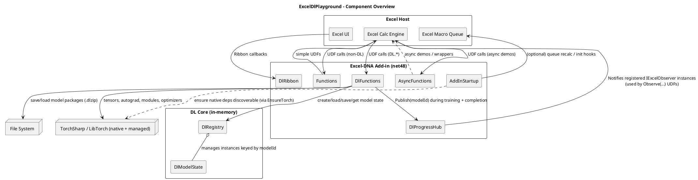
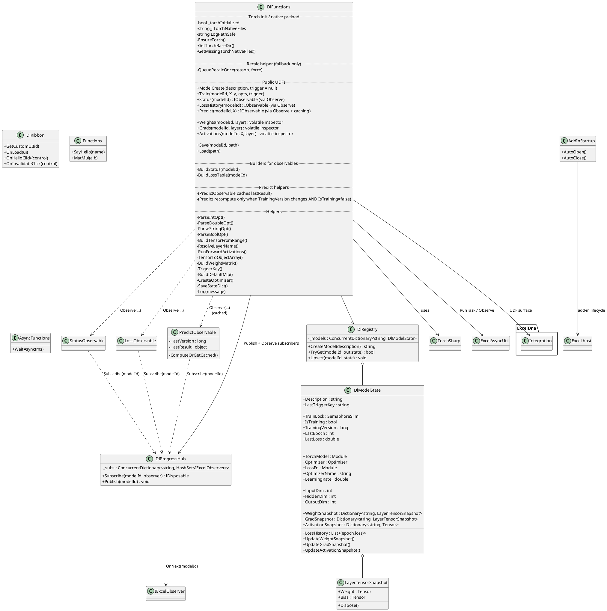
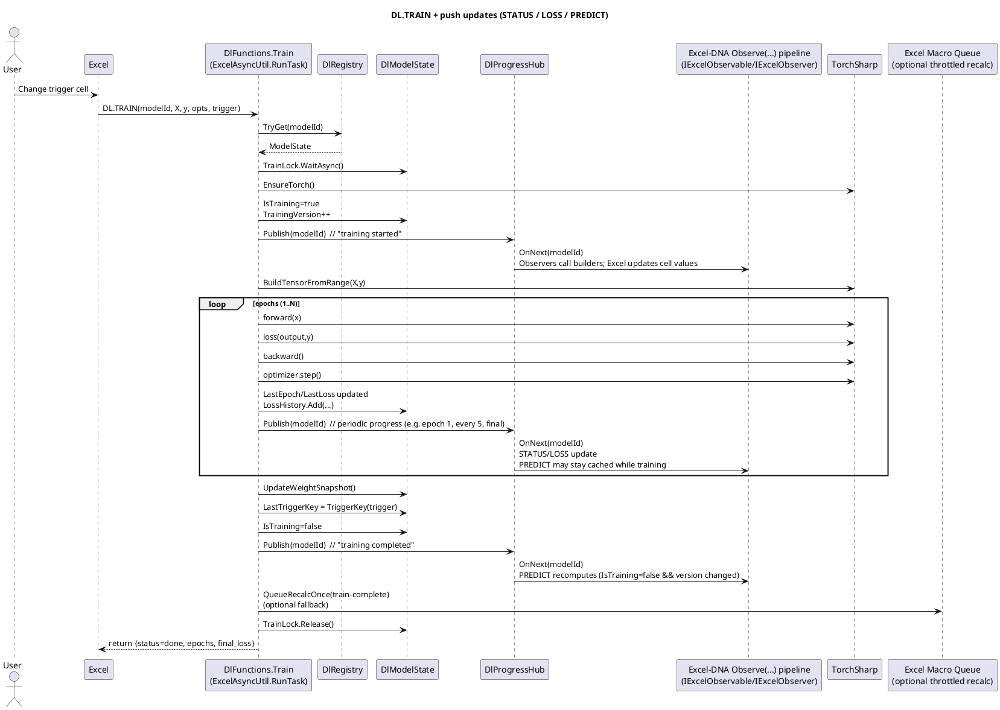

# UML Overview

This document captures the core architecture of `ExcelDlPlayground` using PlantUML. The project is a .NET Framework 4.8 Excel-DNA add-in that hosts TorchSharp-based deep learning helpers exposed as Excel UDFs.

Key architectural facts reflected below:

* **`DL.TRAIN` runs async** via `ExcelAsyncUtil.RunTask(...)` and updates in-memory model state.

* **Push-based UI updates** are done via **`ExcelAsyncUtil.Observe(...)` + `DlProgressHub.Publish(...)`** (STATUS / LOSS\_HISTORY / PREDICT).

* `QueueRecalcOnce(xlcCalculateNow)` is a **throttled fallback**, mainly useful for volatile/legacy cells — _not required_ for the observable functions.

* `DL.PREDICT` is implemented as an **observable with caching** so it doesn’t flicker or block Excel; it recomputes only when a **new stable model version** is available.

- - -

## Component Diagram

### Notes

- Removed “xlcCalculateNow on load” as a *hard* behavior — startup recalc is not fundamental to the architecture.

- Made the **observable loop explicit**: `DlProgressHub` signals, and `ExcelAsyncUtil.Observe(...)` consumers re-emit values.

- Clarified that **Torch** includes both managed + native dependencies.

## Class Diagram (Key Types)

### Notes

- `Status`, `LossHistory`, **and `Predict`** are modelled as *observable outputs* (this is crucial).

- `QueueRecalcOnce` is explicitly framed as a **fallback**, not the primary update mechanism.

- `PredictObservable` caching behaviour is captured at a conceptual level.

## Sequence (Training happy path)

### Notes

- Shows that **PREDICT recompute happens at “stable model” time** (when `IsTraining=false` and `TrainingVersion` changed).

- Makes the observer loop explicit, rather than implying calc engine pulls values.

- Explicitly marks macro recalc as optional.

