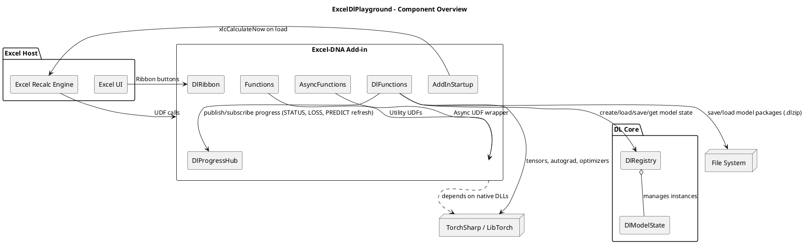

# UML Overview

This document captures the core architecture of `ExcelDlPlayground` using PlantUML. The project is a .NET Framework 4.8 Excel-DNA add-in that hosts TorchSharp-based deep learning helpers exposed as Excel UDFs.

## Component Diagram



## Class Diagram (Key Types)

```plantuml
@startuml
skinparam classAttributeIconSize 0

class DlFunctions {
  - bool _torchInitialized
  - string[] TorchNativeFiles
  - string LogPathSafe
  .. Torch init ..
  - EnsureTorch()
  - GetTorchBaseDir()
  - GetMissingTorchNativeFiles()
  .. Observables ..
  + Status(modelId)
  + LossHistory(modelId)
  + Predict(modelId, X)
  - BuildStatus(modelId)
  - BuildLossTable(modelId)
  - QueueRecalcOnce(reason, force)
  .. Public UDFs ..
  + ModelCreate(description, trigger)
  + Save(modelId, path)
  + Load(path)
  + Train(modelId, X, y, opts, trigger)
  + Weights(modelId, layer)
  + Grads(modelId, layer)
  + Activations(modelId, X, layer)
  .. Helpers ..
  - ParseIntOpt()
  - ParseDoubleOpt()
  - ParseStringOpt()
  - ParseBoolOpt()
  - BuildTensorFromRange()
  - ResolveLayerName()
  - RunForwardActivations()
  - TensorToObjectArray()
  - BuildWeightMatrix()
  - TriggerKey()
  - RangeKey()
  - BuildDefaultMlp()
  - CreateOptimizer()
  - SaveStateDict()
  - Log(message)
}

class DlProgressHub {
  - _subs : ConcurrentDictionary
  + Subscribe(modelId, observer)
  + Publish(modelId)
}

class DlRegistry {
  - _models : ConcurrentDictionary
  + CreateModel(description)
  + TryGet(modelId, out state)
  + Upsert(modelId, state)
}

class DlModelState {
  + Description : string
  + LastTriggerKey : string
  + TrainLock : SemaphoreSlim
  + LossHistory : List
  + TorchModel : Module
  + Optimizer : Optimizer
  + LossFn : Module
  + WeightSnapshot : Dictionary
  + GradSnapshot : Dictionary
  + ActivationSnapshot : Dictionary
  + OptimizerName : string
  + LearningRate : double
  + InputDim : int
  + HiddenDim : int
  + OutputDim : int
  + IsTraining : bool
  + TrainingVersion : long
  + LastEpoch : int
  + LastLoss : double
  + UpdateWeightSnapshot()
  + UpdateGradSnapshot()
  + UpdateActivationSnapshot()
}

class LayerTensorSnapshot {
  + Weight : Tensor
  + Bias : Tensor
  + Dispose()
}

class Functions { + SayHello(name) + MatMul(a, b) }
class AsyncFunctions { + WaitAsync(ms) }
class AddInStartup { + AutoOpen() + AutoClose() }
class DlRibbon { + GetCustomUI(ribbonId) + OnLoad(ribbonUi) + OnHelloClick(control) + OnInvalidateClick(control) }

DlFunctions --> DlRegistry
DlFunctions --> DlProgressHub : publish / subscribe (STATUS, LOSS, PREDICT)
DlRegistry o-- DlModelState
DlModelState o-- LayerTensorSnapshot
DlFunctions --> "TorchSharp" : uses
DlFunctions --> "ExcelDna.Integration" : UDF surface
Functions --> "ExcelDna.Integration" : UDFs
AsyncFunctions --> "ExcelAsyncUtil" : async wrapper
AddInStartup --> "Excel xlcCalculateNow" : triggers recalc
DlRibbon --> "Excel Ribbon UI" : callbacks
@enduml
```

## Sequence (Training happy path)

```plantuml
@startuml
actor User
participant Excel
participant "DlFunctions.Train" as Train
participant DlRegistry
participant DlModelState as Model
participant DlProgressHub as Hub
participant TorchSharp
participant "Volatile Inspectors" as Inspect

User -> Excel : Change trigger cell
Excel -> Train : DL.TRAIN(model_id, X, y, opts, trigger)
Train -> DlRegistry : TryGet(model_id)
Train -> Model : TrainLock.WaitAsync()
Train -> TorchSharp : EnsureTorch()
Train -> TorchSharp : Build tensors (X,y)
Train -> Hub : Publish(start)
loop epochs
  Train -> TorchSharp : forward(x)
  Train -> TorchSharp : loss(output, y)
  Train -> TorchSharp : backward()
  Train -> TorchSharp : optimizer.step()
  Train -> Model : UpdateGradSnapshot()
  Train -> Hub : Publish(progress)
end
Train -> Model : UpdateWeightSnapshot(); LastTriggerKey=trigger
Train -> Hub : Publish(final)
Train -> Inspect : QueueRecalcOnce(train-complete)
Train -> Excel : return {status=done, epochs, final_loss}
@enduml