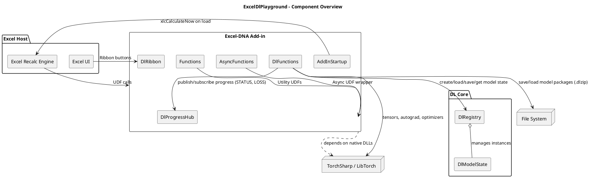

# UML Overview

This document captures the core architecture of `ExcelDlPlayground` using PlantUML. The project is a .NET Framework 4.8 Excel-DNA add-in that hosts TorchSharp-based deep learning helpers exposed as Excel UDFs.

## Component Diagram



## Class Diagram (Key Types)

```plantuml
@startuml
skinparam classAttributeIconSize 0

class DlFunctions {
  - bool _torchInitialized
  - string[] TorchNativeFiles
  - string LogPathSafe
  .. Torch init ..
  - EnsureTorch()
  - GetTorchBaseDir()
  - GetMissingTorchNativeFiles(baseDir)
  .. Observables ..
  + Status(model_id)
  + LossHistory(model_id)
  - BuildStatus(model_id)
  - BuildLossTable(model_id)
  - QueueRecalcOnce(reason, force)
  .. Public UDFs ..
  + ModelCreate(description)
  + Save(model_id, path)
  + Load(path)
  + Train(model_id, X, y, opts, trigger)
  + Predict(model_id, X)
  + Weights(model_id, layer)
  + Grads(model_id, layer)
  + Activations(model_id, X, layer)
  .. Helpers ..
  - ParseIntOpt(opts, key, default)
  - ParseDoubleOpt(opts, key, default)
  - ParseStringOpt(opts, key, default)
  - ParseBoolOpt(opts, key, default)
  - BuildTensorFromRange(values, expectedCols, label)
  - ResolveLayerName(model, layer, requireWeightedLayer, out error)
  - RunForwardActivations(model, xTensor)
  - TensorToObjectArray(tensor)
  - BuildWeightMatrix(weight, bias)
  - TriggerKey(trigger)
  - BuildDefaultMlp(input, hidden, output)
  - CreateOptimizer(model)
  - SaveStateDict(dict, path)
  - Log(message)
}

class DlProgressHub {
  - ConcurrentDictionary<string, HashSet<IExcelObserver>> _subs
  + Subscribe(modelId, observer)
  + Publish(modelId)
}

class DlRegistry {
  - ConcurrentDictionary<string, DlModelState> _models
  + CreateModel(description)
  + TryGet(modelId, out state)
  + Upsert(modelId, state)
}

class DlModelState {
  + string Description
  + string LastTriggerKey
  + SemaphoreSlim TrainLock
  + List<(int epoch, double loss)> LossHistory
  + torch.nn.Module TorchModel
  + torch.optim.Optimizer Optimizer
  + torch.nn.Module LossFn
  + Dictionary<string, LayerTensorSnapshot> WeightSnapshot
  + Dictionary<string, LayerTensorSnapshot> GradSnapshot
  + Dictionary<string, Tensor> ActivationSnapshot
  + string OptimizerName
  + double LearningRate
  + int InputDim
  + int HiddenDim
  + int OutputDim
  + bool IsTraining
  + long TrainingVersion
  + int LastEpoch
  + double LastLoss
  + UpdateWeightSnapshot()
  + UpdateGradSnapshot()
  + UpdateActivationSnapshot(activations)
}

class LayerTensorSnapshot {
  + Tensor Weight
  + Tensor Bias
  + Dispose()
}

class Functions { + SayHello(name) + MatMul(a, b) }
class AsyncFunctions { + WaitAsync(ms) }
class AddInStartup { + AutoOpen() + AutoClose() }
class DlRibbon { + GetCustomUI(ribbonId) + OnLoad(ribbonUi) + OnHelloClick(control) + OnInvalidateClick(control) }

DlFunctions --> DlRegistry
DlFunctions --> DlProgressHub : publish / subscribe (STATUS, LOSS)
DlRegistry o-- DlModelState
DlModelState o-- LayerTensorSnapshot
DlFunctions --> "TorchSharp\n(torch, tensors, optimizers)" : uses
DlFunctions --> "ExcelDna.Integration" : UDF surface
Functions --> "ExcelDna.Integration" : UDFs
AsyncFunctions --> "ExcelAsyncUtil" : async wrapper
AddInStartup --> "Excel xlcCalculateNow" : triggers recalc
DlRibbon --> "Excel Ribbon UI" : callbacks
@enduml
```

## Sequence (Training happy path)

```plantuml
@startuml
actor User
participant Excel
participant "DlFunctions.Train" as Train
participant DlRegistry
participant DlModelState as Model
participant DlProgressHub as Hub
participant TorchSharp
participant "Volatile Inspectors" as Inspect

User -> Excel : Change trigger cell
Excel -> Train : DL.TRAIN(model_id, X, y, opts, trigger)
Train -> DlRegistry : TryGet(model_id)
Train -> Model : TrainLock.WaitAsync()
Train -> TorchSharp : EnsureTorch()
Train -> TorchSharp : Build tensors (X,y)
Train -> Hub : Publish(start)
loop epochs
  Train -> TorchSharp : forward(x)
  Train -> TorchSharp : loss(output, y)
  Train -> TorchSharp : backward()
  Train -> TorchSharp : optimizer.step()
  Train -> Model : UpdateGradSnapshot()
  Train -> Hub : Publish(progress) **epoch1 + every 5 + final**
end
Train -> Model : UpdateWeightSnapshot(); LastTriggerKey=trigger
Train -> Hub : Publish(final)
Train -> Inspect : QueueRecalcOnce(train-complete) **throttled**
Train -> Excel : return {status=done, epochs, final_loss}
@enduml
